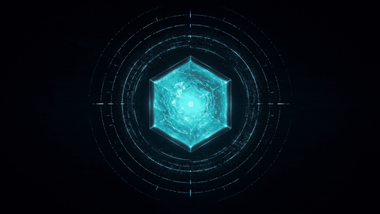
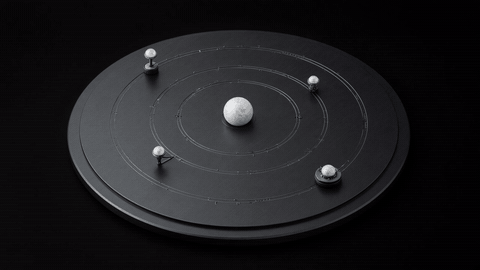
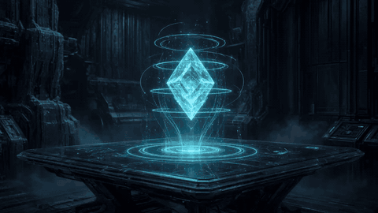

<div align="center">




# CRYO / PIERREG99

### Profile Documentation & Portfolio Hub

[](https://github.com/Pierreg99)
[](https://github.com/Pierreg99/progress)
[](https://github.com/Pierreg99?tab=repositories)
[](https://github.com/Pierreg99/progress/blob/main/docs/account-sync-2026-09-12.md)
[](./docs/)

</div>

---

# Motion Showcase

<div align="center">








</div>

**Pulse** is the identity/status motion layer. **Orbit** is the engineering/system motion layer. **Memory / HUD / Voxel** are flagship presentation accents. All are local repository assets and require no runtime dependency. GIFs are presentation, not technical proof.

[Open the full Animation Gallery →](./docs/animation-gallery.html)

---

# Portfolio Intelligence

The authenticated GitHub inventory contains **99 repositories** in the current snapshot (**12 September 2026**): **40 public** and **59 private**. Public portfolio surfaces expose the public inventory; private work remains subject to the existing codename/redaction policy.

The portfolio is intentionally presented as a hierarchy rather than equally weighted projects: **Flagships → Products → Research → Experiments → Assets / Archive**.

### Audit & Portfolio

| Surface | DE | EN |
|---|---|---|
| Account-wide repository sync | [Snapshot](https://github.com/Pierreg99/progress/blob/main/docs/account-sync-2026-09-12.md) | [Snapshot](https://github.com/Pierreg99/progress/blob/main/docs/account-sync-2026-09-12.md) |
| Portfolio hub | [Deutsch](https://github.com/Pierreg99/progress/blob/main/README.de.md) | [English](https://github.com/Pierreg99/progress/blob/main/README.en.md) |
| Visual portfolio | [Deutsch](https://github.com/Pierreg99/progress/blob/main/site/index.de.html) | [English](https://github.com/Pierreg99/progress/blob/main/site/index.en.html) |
| Historical 2026 audit | [Deutsch](https://github.com/Pierreg99/progress/blob/main/docs/portfolio-audit-2026-09-08.de.md) | [English](https://github.com/Pierreg99/progress/blob/main/docs/portfolio-audit-2026-09-08.en.md) |

### Flagship proof set

`agent-memory` · `cryos-launcher` · `Chronicles-of-Lumina-GameRPGwork` · `ResidentLovely-Maximum-Hapiness-Game` · `KiBlox-VoxelGame` · `Nexo-Jarvis-AI-Futuristic-Assistant-Alpha` · `Cryo-Motion-Studio-Concept-Websuite` · `progress`

The selection is based on visible evidence strength, engineering depth, documentation, interactive value and public portfolio usefulness. It is not a certification.

---

# Sprache auswählen / Select Language

## Deutsch

| Dokument | Öffnen |
|---|---|
| **Profil** | [Deutsches Profil öffnen →](./docs/de/PROFILE-DE.md) |
| **Technischer Stack** | [Deutsche Stack-Dokumentation →](./docs/de/TECH-STACK-DE.md) |
| **Technischer Qualitätsaudit** | [Deutschen Audit öffnen →](./docs/de/TECHNICAL-QUALITY-AUDIT-DE.md) |
| **Akademisches Benchmark-Dashboard** | [Deutsches Dashboard öffnen →](./docs/de/ACADEMIC-DASHBOARD-DE.md) |
| **Fortschritt: Geschwindigkeit & Qualität** | [Deutschen Fortschrittsbericht öffnen →](./docs/de/PROGRESS-SPEED-QUALITY-DE.md) |
| **Pierreg99 vs. Alle Referenzprofile** | [Gesamtbenchmark Deutsch →](./docs/de/PIERREG99-VS-ALL-BENCHMARK-DE.md) |
| **99-Repository Account-Sync** | [Vollständigen Sync-Snapshot öffnen →](https://github.com/Pierreg99/progress/blob/main/docs/account-sync-2026-09-12.md) |
| **Profil-Designsystem** | [Deutsches Designsystem →](./docs/de/PROFILE-DESIGN-SYSTEM-DE.md) |
| **Profilvarianten** | [Deutsche Varianten →](./docs/de/PROFILE-VARIANTS-DE.md) |
| **Animation Gallery** | [Motion Showcase öffnen →](./docs/animation-gallery.html) |
| **Academic Tasks** | [Aufgaben, Zeiten & Fortschritt →](./academic-evaluation/task-time-progress/TASK_TIME_PROGRESS_DE.md) |
| **Pierreg99 vs Dev / Team** | [Deutschen Vergleich öffnen →](./docs/de/PIERREG99-VS-DEV-COMPARISON-DE.md) |
| **Time-to-Value vs Dev / Team** | [Deutschen TTV-Vergleich öffnen →](./docs/de/PIERREG99-TIME-TO-VALUE-COMPARISON-DE.md) |
| **Tägliche Academic Reports** | [Deutsche Reports öffnen →](./reports/daily/2026-09-07/DAILY-REPORT-DE.md) |

## English

| Document | Open |
|---|---|
| **Profile** | [Open English profile →](./docs/en/PROFILE-EN.md) |
| **Technical Stack** | [Open English stack documentation →](./docs/en/TECH-STACK-EN.md) |
| **Technical Quality Audit** | [Open English audit →](./docs/en/TECHNICAL-QUALITY-AUDIT-EN.md) |
| **Academic Benchmark Dashboard** | [Open English dashboard →](./docs/en/ACADEMIC-DASHBOARD-EN.md) |
| **Progress: Speed & Quality** | [Open English progress report →](./docs/en/PROGRESS-SPEED-QUALITY-EN.md) |
| **Pierreg99 vs. All Reference Profiles** | [Overall benchmark English →](./docs/en/PIERREG99-VS-ALL-BENCHMARK-EN.md) |
| **99-Repository Account Sync** | [Open full sync snapshot →](https://github.com/Pierreg99/progress/blob/main/docs/account-sync-2026-09-12.md) |
| **Profile Design System** | [Open English design system →](./docs/en/PROFILE-DESIGN-SYSTEM-EN.md) |
| **Profile Variants** | [Open English variants →](./docs/en/PROFILE-VARIANTS-EN.md) |
| **Animation Gallery** | [Open motion showcase →](./docs/animation-gallery.html) |
| **Academic Tasks** | [Tasks, Time & Progress →](./academic-evaluation/task-time-progress/TASK_TIME_PROGRESS_EN.md) |
| **Pierreg99 vs Dev / Team** | [Open English comparison →](./docs/en/PIERREG99-VS-DEV-COMPARISON-EN.md) |
| **Time-to-Value vs Dev / Team** | [Open English TTV-comparison →](./docs/en/PIERREG99-TIME-TO-VALUE-COMPARISON-EN.md) |
| **Daily Academic Reports** | [Open English reports →](./reports/daily/2026-09-07/DAILY-REPORT-EN.md) |

---

# Live Portfolio

[Open the interactive profile (GitHub Pages target) →](https://pierreg99.github.io/Pierreg99-Pierreg99-Profile-Page/)

[Open GitHub](https://github.com/Pierreg99) · [X / cryofreee](https://x.com/cryofreee) · [Beacons](https://beacons.ai/cryopg.it)

[Open the live portfolio audit hub →](https://github.com/Pierreg99/progress)

[Open the German visual portfolio →](https://github.com/Pierreg99/progress/blob/main/site/index.de.html)

[Open the English visual portfolio →](https://github.com/Pierreg99/progress/blob/main/site/index.en.html)

[Open the account-wide repository sync snapshot →](https://github.com/Pierreg99/progress/blob/main/docs/account-sync-2026-09-12.md)

[Open the live benchmark dashboard →](./dashboard/)

[Open the daily research index →](./reports/daily/)

---

# Repository Structure

```text
.
├── README.md
├── dashboard/
│   └── index.html
├── docs/
│   ├── animation-gallery.html
│   ├── de/
│   └── en/
├── academic-evaluation/
├── reports/
└── assets/
    ├── animations/
    │   ├── cryo-pulse.gif
    │   └── cryo-orbit.gif
    ├── cryo-header.svg
    ├── immersive-dashboard.svg
    ├── language-technology-matrix.svg
    └── project-grid.svg
```

# Language Separation Policy

Deutsch und English sind auf Dokumentebene vollständig getrennt. Jede sprachspezifische Datei enthält nur ihre eigene Sprache; gleichwertige Inhalte liegen als separat anklickbare DE- und EN-Dokumente vor.

`README.md` dient als Startseite, Portfolio-Einstieg und Sprach-Navigation.

# Motion / Asset Policy

Die GIFs sind Teil der repository-nativen Präsentationsschicht. Sie sind keine externen Statistik- oder Laufzeitdienste und stellen keine unabhängige technische Evidenz dar.

# Evidence Policy

Repository-Fakten, GitHub-Metadaten, ausgeführte Tests und redaktionelle Portfolio-Bewertungen werden getrennt behandelt. Nicht verifizierte Fertigstellungswerte werden nicht als Tatsachen veröffentlicht.
