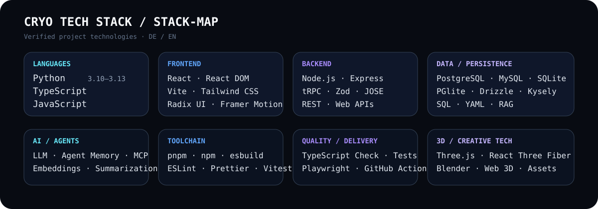

<div align="center">


# CRYO / PIERREG99

### Profile Documentation Hub · Visual Stack System

[](https://github.com/Pierreg99)
[](https://github.com/Pierreg99/Pierreg99-Pierreg99-Profile-Page)
[](./docs/)
[](./assets/stack-progress.svg)

</div>

---

# Sprache auswählen / Select Language

## Deutsch

| Dokument | Öffnen |
|---|---|
| **Profil** | [Deutsches Profil öffnen →](./docs/de/PROFILE-DE.md) |
| **Technischer Stack** | [Deutsche Stack-Dokumentation →](./docs/de/TECH-STACK-DE.md) |
| **Stack-Fortschritt** | [Visuelle Fortschrittsmatrix →](./assets/stack-progress.svg) |
| **Stack-Icons** | [Visuelle Icon-Wand →](./assets/stack-icons.svg) |
| **Technischer Qualitätsaudit** | [Deutschen Audit öffnen →](./docs/de/TECHNICAL-QUALITY-AUDIT-DE.md) |
| **Profil-Designsystem** | [Deutsches Designsystem →](./docs/de/PROFILE-DESIGN-SYSTEM-DE.md) |
| **Profilvarianten** | [Deutsche Varianten →](./docs/de/PROFILE-VARIANTS-DE.md) |
| **Academic Evaluation** | [Deutsche Evaluation →](./docs/de/ACADEMIC-EVALUATION-DE.md) |
| **Pierreg99 vs Dev / Team** | [Deutschen Vergleich öffnen →](./docs/de/PIERREG99-VS-DEV-COMPARISON-DE.md) |
| **Time-to-Value vs Dev / Team** | [Deutschen TTV-Vergleich öffnen →](./docs/de/PIERREG99-TIME-TO-VALUE-COMPARISON-DE.md) |

## English

| Document | Open |
|---|---|
| **Profile** | [Open English profile →](./docs/en/PROFILE-EN.md) |
| **Technical Stack** | [Open English stack documentation →](./docs/en/TECH-STACK-EN.md) |
| **Stack Progress** | [Open visual progress matrix →](./assets/stack-progress.svg) |
| **Stack Icons** | [Open visual icon wall →](./assets/stack-icons.svg) |
| **Technical Quality Audit** | [Open English audit →](./docs/en/TECHNICAL-QUALITY-AUDIT-EN.md) |
| **Profile Design System** | [Open English design system →](./docs/en/PROFILE-DESIGN-SYSTEM-EN.md) |
| **Profile Variants** | [Open English variants →](./docs/en/PROFILE-VARIANTS-EN.md) |
| **Academic Evaluation** | [Open English evaluation →](./docs/en/ACADEMIC-EVALUATION-EN.md) |
| **Pierreg99 vs Dev / Team** | [Open English comparison →](./docs/en/PIERREG99-VS-DEV-COMPARISON-EN.md) |
| **Time-to-Value vs Dev / Team** | [Open English TTV comparison →](./docs/en/PIERREG99-TIME-TO-VALUE-COMPARISON-EN.md) |

---

# Visual Stack System




---

# Repository Structure

```text
.
├── README.md
├── docs/
│   ├── de/
│   │   ├── PROFILE-DE.md
│   │   ├── PROFILE-DESIGN-SYSTEM-DE.md
│   │   ├── PROFILE-VARIANTS-DE.md
│   │   ├── ACADEMIC-EVALUATION-DE.md
│   │   ├── TECH-STACK-DE.md
│   │   ├── TECHNICAL-QUALITY-AUDIT-DE.md
│   │   ├── PIERREG99-VS-DEV-COMPARISON-DE.md
│   │   └── PIERREG99-TIME-TO-VALUE-COMPARISON-DE.md
│   └── en/
│       ├── PROFILE-EN.md
│       ├── PROFILE-DESIGN-SYSTEM-EN.md
│       ├── PROFILE-VARIANTS-EN.md
│       ├── ACADEMIC-EVALUATION-EN.md
│       ├── TECH-STACK-EN.md
│       ├── TECHNICAL-QUALITY-AUDIT-EN.md
│       ├── PIERREG99-VS-DEV-COMPARISON-EN.md
│       └── PIERREG99-TIME-TO-VALUE-COMPARISON-EN.md
├── academic-evaluation/
│   └── task-time-progress/
│       ├── TASK_TIME_PROGRESS_DE.md
│       └── TASK_TIME_PROGRESS_EN.md
└── assets/
    ├── cryo-header.svg
    ├── stack-map.svg
    ├── stack-icons.svg
    ├── stack-progress.svg
    └── project-grid.svg
```

---

# Language Separation Policy

Deutsch und English sind auf Dokumentebene vollständig getrennt. Jede sprachspezifische Datei enthält nur ihre eigene Sprache. Die Stack-Ansichten, Fortschrittsdaten und Profilseiten sind separat verlinkt.

`README.md` dient als Startseite, visueller Stack-Hub und Sprach-Navigation.
