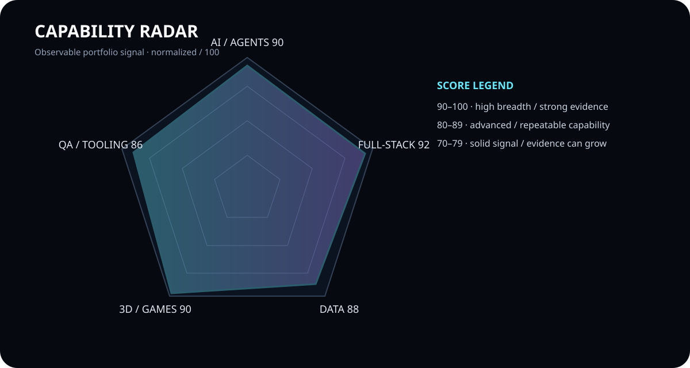
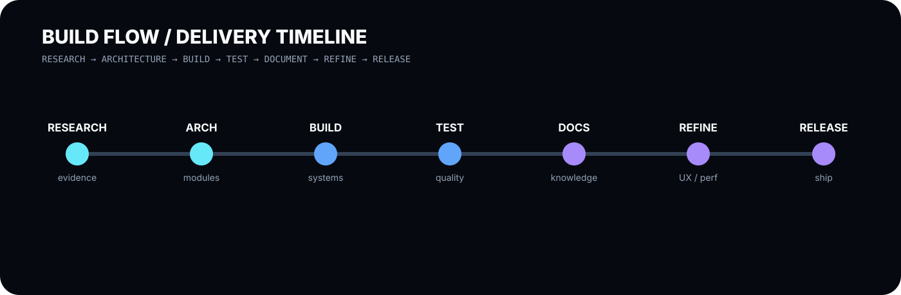

# CRYO / PIERREG99

### AI · Software Engineering · Web · Games · 3D · Research

---

# Live Interactive Profile

**[Open the deployed CRYO / Pierreg99 profile →](https://pierreg99.github.io/Pierreg99-Pierreg99-Profile-Page/)**

The live page contains interactive language filters, project exploration, bilingual navigation, the CRYO visual system and the repository-native animated layer.

---

# Profile Navigator

| Deutsch | English |
|---|---|
| [Profil →](./docs/de/PROFILE-DE.md) | [Profile →](./docs/en/PROFILE-EN.md) |
| [Technischer Stack →](./docs/de/TECH-STACK-DE.md) | [Technical Stack →](./docs/en/TECH-STACK-EN.md) |
| [Programmiersprachen →](./docs/de/PROGRAMMING-LANGUAGES-DE.md) | [Programming Languages →](./docs/en/PROGRAMMING-LANGUAGES-EN.md) |
| [Öffentlicher Sprachreport →](./docs/de/PUBLIC-LANGUAGE-PROFILE-DE.md) | [Public Language Report →](./docs/en/PUBLIC-LANGUAGE-PROFILE-EN.md) |
| [Interaktives Dashboard →](./docs/public-language-dashboard.html) | [Interactive Dashboard →](./docs/public-language-dashboard.html) |
| [Qualitätsaudit →](./docs/de/TECHNICAL-QUALITY-AUDIT-DE.md) | [Quality Audit →](./docs/en/TECHNICAL-QUALITY-AUDIT-EN.md) |

## Daily Academic Research / Tägliche Academic Research

| Deutsch | English |
|---|---|
| [Tagesreport 2026-09-07 →](./reports/daily/2026-09-07/DAILY-REPORT-DE.md) | [Daily report 2026-09-07 →](./reports/daily/2026-09-07/DAILY-REPORT-EN.md) |
| [Academic Benchmark →](./reports/daily/2026-09-07/ACADEMIC-BENCHMARK-DE.md) | [Academic Benchmark →](./reports/daily/2026-09-07/ACADEMIC-BENCHMARK-EN.md) |
| [Alle Daily Reports →](./reports/daily/README.md) | [All daily reports →](./reports/daily/README.md) |

---

# About / CRYO Focus

**Cryopg.it / Pierreg99** develops experimental and product-oriented systems across **Artificial Intelligence, software engineering, web applications, games, 3D and knowledge systems**.

The profile is deliberately evidence-led: verified repository technology is presented as evidence, while broader design vocabulary is clearly separated from claims of usage.

**Engineering loop:** `Research → Architecture → Build → Test → Document → Refine → Release`

---

# Connect / Explore

---

# Contribution & Activity Layer

GitHub contribution charts and external stats services can change independently of this repository. The stable profile therefore prioritizes repository-native evidence, direct project links, and renderer-safe badges rather than depending on third-party dashboards.

[Open the public project language dashboard →](./docs/public-language-dashboard.html)

---

# Programming Languages

The current public-project snapshot is based on **GitHub-reported primary repository language** across 15 public repositories.

| Language | Public projects | Project share |
|---|---:|---:|
| **JavaScript** | 6 | **40.00%** |
| **TypeScript** | 5 | **33.33%** |
| **Python** | 2 | **13.33%** |
| **HTML** | 2 | **13.33%** |

**Visible language stack**  
   

> **Metric definition:** project share is not LOC share and not code-byte share. The snapshot is a point-in-time view of public repositories returned by the current account query on **7 September 2026**.

---

# Frameworks, Runtime & Data

**Frontend / Runtime**  
  

**Data**  
  

**Quality / Delivery**  
    

---

# 3D / Games / Creative Systems

The immersive layer focuses on **Three.js, React Three Fiber, Blender, browser games, voxel systems and visual interfaces** where repository evidence supports the technology.

  

---

# Featured Public Projects

- [agent-memory](https://github.com/Pierreg99/agent-memory) — AI / agent memory
- [Nexo-Jarvis-AI-Futuristic-Assistant-Alpha](https://github.com/Pierreg99/Nexo-Jarvis-AI-Futuristic-Assistant-Alpha) — AI assistant / HUD
- [KiBlox-VoxelGame](https://github.com/Pierreg99/KiBlox-VoxelGame) — voxel / game / 3D
- [Chronicles-of-Lumina-GameRPGwork](https://github.com/Pierreg99/Chronicles-of-Lumina-GameRPGwork) — RPG / world
- [Cryoplane-Polygonal-Flight](https://github.com/Pierreg99/Cryoplane-Polygonal-Flight) — 3D / flight
- [Cyberdash-Rhythm-Platformer](https://github.com/Pierreg99/Cyberdash-Rhythm-Platformer) — game / rhythm
- [call-of-groky](https://github.com/Pierreg99/call-of-groky) — browser FPS / Three.js
- [call-of-boty](https://github.com/Pierreg99/call-of-boty) — browser FPS / Three.js

---

# Immersive Visual System

## Animated Layer

The profile also includes repository-native animated GIF accents for the header pulse and engineering orbit. They are intentionally lightweight and dependency-free so the showcase remains self-contained.

---

# Evidence Boundary

The profile follows a strict evidence hierarchy:

1. **Repository evidence** — strongest signal.
2. **GitHub-reported primary language** — used for the public-project language mix.
3. **Technology documentation and visuals** — presentation and orientation.
4. **Custom symbol artwork and animation accents** — visual vocabulary, not proof of usage.

Portfolio scores are evidence signals, not certifications or personnel assessments.

[Asset system →](./assets/README.md) · [Asset catalog →](./assets/ASSET-CATALOG.md) · [Documentation hub →](./docs/README.md)
