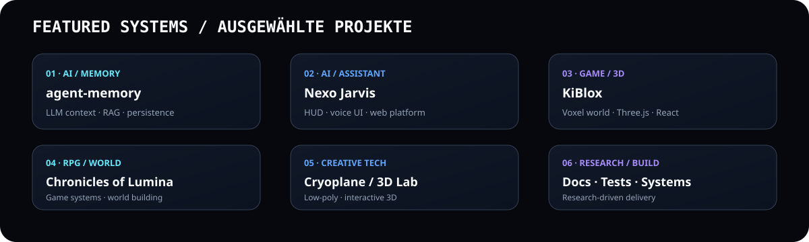

<div align="center">


[](https://github.com/Pierreg99)
[](https://github.com/Pierreg99?tab=repositories)
[](#-programming-languages)
[](./TECHNICAL-QUALITY-AUDIT-DE-EN.md)

**DEUTSCH · ENGLISH**  
**AI · SOFTWARE ENGINEERING · WEB · GAMES · 3D · RESEARCH**

</div>

---

## DE — Profil / Profile

> **Cryopg.it / Pierreg99** entwickelt experimentelle und produktorientierte Systeme an der Schnittstelle von **Künstlicher Intelligenz, Software Engineering, Web, Games, 3D und Wissenssystemen**.

Der Fokus liegt auf **modularer Architektur, Automatisierung, kreativen Interfaces, AI-Agenten, Datenhaltung, Testbarkeit und dokumentierter Weiterentwicklung**.

### Systemübersicht

| Domain | Stack / Fokus |
|---|---|
| **AI & Agents** | LLMs · Agent Memory · RAG · MCP · Context Engineering · Summarization |
| **Programming** | Python · TypeScript · JavaScript |
| **Frontend** | React · React DOM · Vite · Tailwind CSS · Radix UI · Framer Motion |
| **Backend** | Node.js · Express · tRPC · REST APIs · Web APIs · Zod · JOSE |
| **Data** | PostgreSQL · MySQL · SQLite · PGlite · Drizzle ORM · Kysely · SQL |
| **3D / Creative** | Three.js · React Three Fiber · Blender · Web 3D · Voxel Systems |
| **Tooling** | pnpm · npm · esbuild · ESLint · Prettier · TypeScript Compiler |
| **Quality** | Vitest · Playwright · Typecheck · Linting · Automated Tests |
| **Delivery** | Git · GitHub · GitHub Actions · GitHub Pages · Vercel-oriented builds |
| **Knowledge** | Markdown · YAML · Documentation · Reports · Workbooks · Research |

### Sprachgetrennte Dokumente / Language-separated documents

**Deutsch** · [Academic Evaluation](./academic-evaluation/task-time-progress/TASK_TIME_PROGRESS_DE.md) · [Task & Calendar Overview](./academic-evaluation/task-time-progress/README.md)

**English** · [Academic Evaluation](./academic-evaluation/task-time-progress/TASK_TIME_PROGRESS_EN.md) · [Task & Calendar Overview](./academic-evaluation/task-time-progress/README.md)

---

## EN — Profile

> **Cryopg.it / Pierreg99** builds experimental and product-oriented systems across **Artificial Intelligence, software engineering, web, games, 3D and knowledge systems**.

The approach emphasizes **modular architecture, automation, creative interfaces, AI agents, persistence, testability and documented iteration**.

### System Overview

| Domain | Stack / Focus |
|---|---|
| **AI & Agents** | LLMs · Agent Memory · RAG · MCP · Context Engineering · Summarization |
| **Programming** | Python · TypeScript · JavaScript |
| **Frontend** | React · React DOM · Vite · Tailwind CSS · Radix UI · Framer Motion |
| **Backend** | Node.js · Express · tRPC · REST APIs · Web APIs · Zod · JOSE |
| **Data** | PostgreSQL · MySQL · SQLite · PGlite · Drizzle ORM · Kysely · SQL |
| **3D / Creative** | Three.js · React Three Fiber · Blender · Web 3D · Voxel Systems |
| **Tooling** | pnpm · npm · esbuild · ESLint · Prettier · TypeScript Compiler |
| **Quality** | Vitest · Playwright · Typecheck · Linting · Automated Tests |
| **Delivery** | Git · GitHub · GitHub Actions · GitHub Pages · Vercel-oriented builds |
| **Knowledge** | Markdown · YAML · Documentation · Reports · Workbooks · Research |

### Separate language documents

**Deutsch** · [Aufgaben, Zeiten & Fortschritt](./academic-evaluation/task-time-progress/TASK_TIME_PROGRESS_DE.md) · [Task & Calendar Overview](./academic-evaluation/task-time-progress/README.md)

**English** · [Tasks, Time & Progress](./academic-evaluation/task-time-progress/TASK_TIME_PROGRESS_EN.md) · [Task & Calendar Overview](./academic-evaluation/task-time-progress/README.md)

---

# Programming Languages

### Verified public profile languages

<div align="center">


</div>

**Python** — AI/agent tooling, memory systems, data and automation.  
**TypeScript** — full-stack web applications, dashboards, 3D interfaces and typed services.  
**JavaScript** — interactive web applications, game systems and browser tooling.

### Supporting languages / formats

`HTML` · `CSS` · `SQL` · `YAML` · `Markdown` · `JSON` · `Shell / CLI`

---

# Technical Stack / Technischer Stack


## AI / Agents

`LLM Applications` · `Agent Memory` · `RAG` · `Context Windowing` · `Summarization` · `Embeddings` · `MCP` · `AI Assistants`

## Frontend / UI

`React 19` · `React DOM` · `Vite` · `Tailwind CSS` · `Radix UI` · `Lucide React` · `Framer Motion` · `React Hook Form` · `TanStack Query` · `Recharts` · `Wouter`

## Backend / Application Layer

`Node.js` · `Express` · `tRPC` · `REST` · `Web APIs` · `Axios` · `Zod` · `JOSE` · `dotenv` · `SuperJSON`

## Data / Persistence

`PostgreSQL` · `MySQL` · `SQLite` · `PGlite` · `Drizzle ORM` · `Kysely` · `SQL` · `YAML`

## 3D / Graphics / Games

`Three.js` · `React Three Fiber` · `@react-three/drei` · `Blender` · `Voxel Rendering` · `Web 3D` · `Interactive Worlds` · `RPG Systems` · `Card Games` · `Rhythm / Platformer`

## Build / Tooling

`pnpm` · `npm` · `esbuild` · `Vite` · `TypeScript Compiler` · `ESLint` · `Prettier` · `PostCSS` · `Tailwind` · `Nitro`

## Testing / Validation

`Vitest` · `Playwright` · `Node Test Runner` · `Typecheck` · `Lint` · `Invariant Checks` · `Automated Build Validation`

---

# Featured Projects / Ausgewählte Projekte



| Project | Domain | Language / Stack |
|---|---|---|
| [agent-memory](https://github.com/Pierreg99/agent-memory) | AI / Agents | Python |
| [Nexo-Jarvis-AI-Futuristic-Assistant-Alpha](https://github.com/Pierreg99/Nexo-Jarvis-AI-Futuristic-Assistant-Alpha) | AI / Assistant / HUD | TypeScript · React · Vite · Three.js |
| [KiBlox-VoxelGame](https://github.com/Pierreg99/KiBlox-VoxelGame) | Voxel / Game / 3D | TypeScript · React · Three.js |
| [Chronicles-of-Lumina-GameRPGwork](https://github.com/Pierreg99/Chronicles-of-Lumina-GameRPGwork) | RPG / World | JavaScript |
| [Cryoplane-Polygonal-Flight](https://github.com/Pierreg99/Cryoplane-Polygonal-Flight) | 3D / Flight | Project stack |
| [Cyberdash-Rhythm-Platformer](https://github.com/Pierreg99/Cyberdash-Rhythm-Platformer) | Game / Rhythm | JavaScript |
| [Agi3-AI-Music-Player](https://github.com/Pierreg99/Agi3-AI-Music-Player) | AI / Media | Project-specific stack |
| [CryAIPulse](https://github.com/Pierreg99/CryAIPulse) | AI | Project-specific stack |

---

# Architecture / Architektur

```text
                         ┌─────────────────────────┐
                         │       CRYO PROFILE      │
                         │      DE / EN / HUD      │
                         └────────────┬────────────┘
                                      │
                  ┌───────────────────┼───────────────────┐
                  │                   │                   │
             AI / AGENTS        WEB / APPS          GAMES / 3D
                  │                   │                   │
         Python · RAG · MCP     TS · React · Vite   Three.js · Blender
                  │                   │                   │
                  └───────────────────┼───────────────────┘
                                      │
                          ┌───────────▼───────────┐
                          │   DATA / SERVICES     │
                          │ SQL · ORM · APIs      │
                          └───────────┬───────────┘
                                      │
                          ┌───────────▼───────────┐
                          │ BUILD / TEST / SHIP   │
                          │ Vite · Vitest · CI    │
                          └───────────────────────┘
```

---

# Technical Quality Audit / Technischer Qualitätsaudit

**DE:** [Vollständigen technischen Qualitätsaudit öffnen →](./TECHNICAL-QUALITY-AUDIT-DE-EN.md)  
**EN:** [Open the complete technical quality audit →](./TECHNICAL-QUALITY-AUDIT-DE-EN.md)

**Current assessed signal:** `8.8/10 technical capability` · `9.1/10 architecture breadth` · `7.4/10 production-evidence confidence`

The audit includes quality scoring, programming-language assessment, quality-vs-cost modeling and a comparison against junior/mid/senior/full-stack developer team profiles.

---

# Delivery Pipeline / Entwicklungsprozess

**01 Research** → **02 Architecture** → **03 Build** → **04 Test** → **05 Document** → **06 Refine** → **07 Release**

| Phase | Output |
|---|---|
| Research | Requirements, references, technical decisions |
| Architecture | Modules, interfaces, data model |
| Build | UI, services, agents, game systems |
| Test | Typechecks, unit tests, browser tests |
| Document | README, reports, workbooks, technical notes |
| Refine | UX polish, performance, maintainability |
| Release | GitHub, Pages, CI/CD-oriented delivery |

---

# Profile Navigation

**DE**  
[Profil](#de--profil--profile) · [Programmiersprachen](#programming-languages) · [Technischer Stack](#technical-stack--technischer-stack) · [Projekte](#featured-projects--ausgewählte-projekte) · [Qualitätsaudit](#technical-quality-audit--technischer-qualitätsaudit) · [Academic Tasks DE](./academic-evaluation/task-time-progress/TASK_TIME_PROGRESS_DE.md)

**EN**  
[Profile](#en--profile) · [Programming Languages](#programming-languages) · [Technical Stack](#technical-stack--technischer-stack) · [Projects](#featured-projects--ausgewählte-projekte) · [Quality Audit](#technical-quality-audit--technischer-qualitätsaudit) · [Academic Tasks EN](./academic-evaluation/task-time-progress/TASK_TIME_PROGRESS_EN.md)

---

<div align="center">

### BUILD · RESEARCH · DESIGN · CONNECT

**Cryopg.it / Pierreg99**

`Python` · `TypeScript` · `JavaScript` · `React` · `Node.js` · `PostgreSQL` · `Three.js` · `Blender` · `MCP` · `GitHub`

</div>
