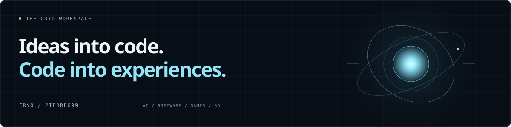

<div align="center">



# CRYO / Pierreg99

AI experiments, software, interfaces, and interactive worlds.

[](https://github.com/Pierreg99)
[](https://pierreg99.github.io/Pierreg99-Pierreg99-Profile-Page/)
[](https://github.com/Pierreg99?tab=repositories)
[](https://github.com/Pierreg99/progress)

[Open the portfolio →](https://pierreg99.github.io/Pierreg99-Pierreg99-Profile-Page/) · [Resources](./docs/) · [Public data](./assets/sync/public-repositories.json)

</div>

## Projects & previews

| Project | Focus | Open |
| --- | --- | --- |
| **Resident Lovely** | Three.js · Adventure · WebGL | [Play](https://pierreg99.github.io/ResidentLovely-Maximum-Hapiness-Game/) · [Source](https://github.com/Pierreg99/ResidentLovely-Maximum-Hapiness-Game) |
| **KiBlox** | TypeScript · Three.js · Voxels | [Play](https://pierreg99.github.io/KiBlox-VoxelGame/) · [Source](https://github.com/Pierreg99/KiBlox-VoxelGame) |
| **cryOS** | TypeScript · Desktop UI · Simulation | [Explore](https://pierreg99.github.io/cryos-launcher/) · [Source](https://github.com/Pierreg99/cryos-launcher) |
| **CryAIPulse** | JavaScript · Canvas · Visualization | [Explore](https://pierreg99.github.io/CryAIPulse/) · [Source](https://github.com/Pierreg99/CryAIPulse) |
| **Cryoplane** | TypeScript · Flight · Three.js | [Play](https://pierreg99.github.io/Cryoplane-Polygonal-Flight/) · [Source](https://github.com/Pierreg99/Cryoplane-Polygonal-Flight) |
| **Cyberdash** | JavaScript · Rhythm · Level editor | [Play](https://pierreg99.github.io/Cyberdash-Rhythm-Platformer/) · [Source](https://github.com/Pierreg99/Cyberdash-Rhythm-Platformer) |
| **Call of Groky** | TypeScript · Three.js · FPS | [Play](https://pierreg99.github.io/call-of-groky/) · [Source](https://github.com/Pierreg99/call-of-groky) |
| **Call of Shooty** | Three.js · Cannon-es · FPS | [Source](https://github.com/Pierreg99/futuristic-call-of-shooty) |
| **AI for Everyone** | Learning · DE / EN · Interactive docs | [Explore](https://pierreg99.github.io/AI-FOR-Everyone-Learn-Docs/en/) · [Source](https://github.com/Pierreg99/AI-FOR-Everyone-Learn-Docs) |
| **Command Wiki** | Linux · Windows · DE / EN | [Explore](https://pierreg99.github.io/Linux-Windows-Helpful-Commands-DOCS/) · [Source](https://github.com/Pierreg99/Linux-Windows-Helpful-Commands-DOCS) |
| **CRYOGAMEHELP** | Guides · Team builder · Fan project | [Source](https://github.com/Pierreg99/inoffical-cryogamehelp-repo) |
| **Cryo Progress** | Progress · Public data · Research | [Explore](https://pierreg99.github.io/progress/) · [Source](https://github.com/Pierreg99/progress) |
| **CRYO Portfolio** | JavaScript · Accessibility · Static site | [Explore](https://pierreg99.github.io/Pierreg99-Pierreg99-Profile-Page/) · [Source](https://github.com/Pierreg99/Pierreg99-Pierreg99-Profile-Page) |
| **Streamflixrouge** | Android · TV · Upstream project | [Source](https://github.com/Pierreg99/Streamflixrouge-OMEGA-FORK) |

[](https://pierreg99.github.io/ResidentLovely-Maximum-Hapiness-Game/)

The portfolio uses each project's own screenshots or repository artwork. Featured cards, the searchable explorer, and the gallery share reviewed descriptions, project pictures, and separate live/source links. Projects without a verified public demo lead to their repositories. [Preview sources and capture notes](assets/projects/README.md) identify local captures and upstream imagery.

## Public inventory

<!-- inventory:start -->
The synchronized inventory contains **73 public repositories**. The account summary records **132 repositories** (**59 private**); private names are never published. The public list comes from GitHub's public user API; the private count is a preserved aggregate from the progress hub.
<!-- inventory:end -->

One versioned snapshot powers the project explorer, public totals, and language distribution. Original projects and public forks are separately filterable. Missing language metadata remains visible. The chart describes project share by primary language, rather than lines of code.

- [Public repository snapshot](./assets/sync/public-repositories.json)
- [Account summary](./assets/sync/account-summary.json)
- [Public language dashboard](https://pierreg99.github.io/Pierreg99-Pierreg99-Profile-Page/docs/public-language-dashboard.html)
- [Progress hub account source](https://github.com/Pierreg99/progress/blob/main/site/account.json)

## Run locally

Requires Node.js 22+, Python 3.10+, and `ffmpeg` on your path.

```sh
npm ci
npm run dev
```

Open `http://localhost:4173`. The development command rebuilds when source files change; refresh the browser to see the result.

```sh
npm run build          # Create the complete static site in dist/
npm run preview        # Serve the production build
npm run check          # Lint, unit tests, build, links, and data validation
npx playwright install --with-deps chromium
npm run test:browser   # Desktop/mobile, accessibility, interactions, and routes
npm run sync           # Refresh the public inventory from GitHub
```

The runtime uses plain HTML, CSS, and native browser modules. Dependencies are used only during authoring, build, and verification. The committed snapshots make builds reproducible without a live API dependency.

## Project structure

```text
src/
  components/          Shared layout, icons, media, explorer, and section templates
  pages/               Home, resources, gallery, languages, research, and reports
  client/              Navigation, localization, project filters, and motion controls
  styles/              Design tokens, base, layout, components, and page styles
  data/                Editorial projects, bilingual UI, documents, and asset registry
  lib/                 HTML helpers and pure portfolio calculations
scripts/
  build.mjs            Static page generation, document rendering, and browser bundles
  prepare-assets.mjs   Responsive WebP, MP4, SVG optimization, and asset manifest
  dev.mjs / serve.mjs   Development rebuilds and a subpath-compatible preview server
  profile_sync/        Validated public metadata synchronization
assets/                Canonical artwork, motion originals, and public snapshots
docs/en/ / docs/de/     Separate English and German source documents
academic-evaluation/   Original historical research datasets and downloads
reports/               Original daily reports and inventories
tests/                 Data, synchronization, link, browser, and accessibility checks
dist/                  Generated deployment artifact (not committed)
```

The legacy page URLs remain available in the generated site. Markdown sources are retained, and the build creates readable HTML documents with working relative links. Directory entry pages cover resources, reports, task records, and the asset library.

## Documentation / Dokumentation

Visual review: [desktop preview](./docs/previews/desktop.webp) · [mobile preview](./docs/previews/mobile.webp).

| Reference | English | Deutsch |
| --- | --- | --- |
| Architecture | [EN](./docs/en/ARCHITECTURE-EN.md) | [DE](./docs/de/ARCHITECTURE-DE.md) |
| Profile | [EN](./docs/en/PROFILE-EN.md) | [DE](./docs/de/PROFILE-DE.md) |
| Technical stack | [EN](./docs/en/TECH-STACK-EN.md) | [DE](./docs/de/TECH-STACK-DE.md) |
| Design system | [EN](./docs/en/PROFILE-DESIGN-SYSTEM-EN.md) | [DE](./docs/de/PROFILE-DESIGN-SYSTEM-DE.md) |
| Historical academic methodology | [EN](./docs/en/ACADEMIC-EVALUATION-EN.md) | [DE](./docs/de/ACADEMIC-EVALUATION-DE.md) |

[Complete document library](./docs/README.md) · [Visual laboratory](https://pierreg99.github.io/Pierreg99-Pierreg99-Profile-Page/docs/animation-gallery.html) · [Asset catalog](./assets/ASSET-CATALOG.md) · [Research archive](https://pierreg99.github.io/Pierreg99-Pierreg99-Profile-Page/dashboard/) · [Daily reports](./reports/daily/)

## Assets and motion

Canonical JPGs, GIFs, MP4, and vectors retain their stable paths. The build prepares responsive WebP images, compressed MP4 versions of all five GIF studies, and an inspectable asset manifest. Motion starts from a still and loads only after playback is requested; leaving the viewport pauses it. Reduced-motion preferences are respected.

Self-hosted Manrope and Space Grotesk fonts include their SIL Open Font License files. The interface uses local fonts, artwork, and data, with no analytics or live API calls. Historical documents retain their GitHub reference badges.

## Delivery and data

Pull requests run the full checks and browser suite, then provide a downloadable site artifact. On `main`, the Pages workflow deploys the validated `dist/` artifact through the standard Pages actions using the existing site's configuration. Deployment runs from `main`, which also matches the configured source branch. The hourly profile sync updates verified public metadata and badges only when their content changes, validates the result, and requests a fresh Pages build after a change.

Research documents and original SVG studies remain a dated archive. Their editorial scores and old inventories are clearly separated from the current public snapshot.

[GitHub](https://github.com/Pierreg99) · [X / cryofreee](https://x.com/cryofreee) · [Beacons](https://beacons.ai/cryopg.it)
