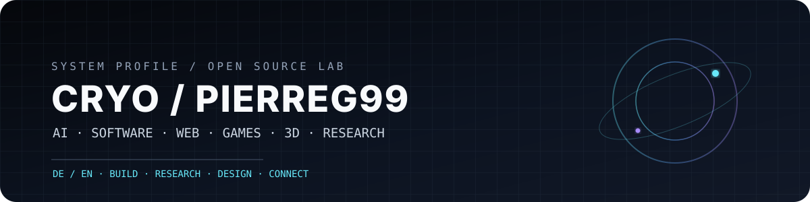
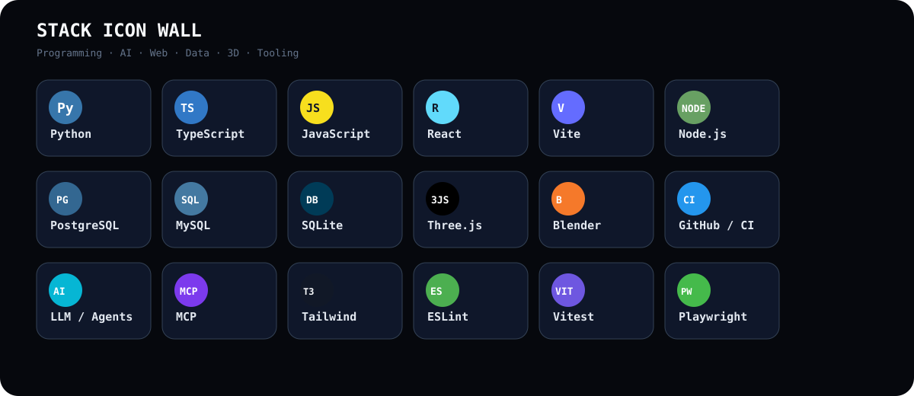
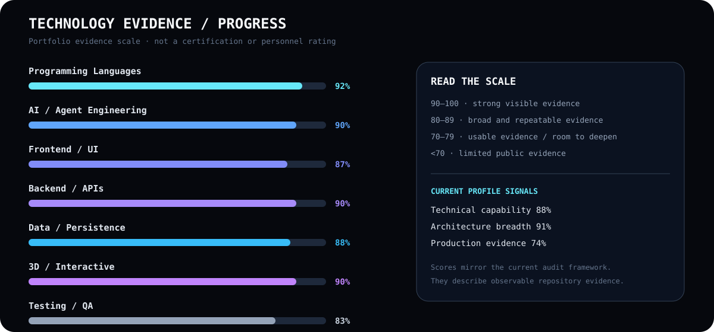

# CRYO / Pierreg99 — Profile

[GitHub](https://github.com/Pierreg99) · [Technical Stack](./TECH-STACK-EN.md) · [Quality Audit](./TECHNICAL-QUALITY-AUDIT-EN.md) · [Academic Evaluation](./ACADEMIC-EVALUATION-EN.md)

## Profile

**Cryopg.it / Pierreg99** builds experimental and product-oriented systems across **Artificial Intelligence, software engineering, web, games, 3D and knowledge systems**.

The focus is modular architecture, automation, creative interfaces, AI agents, persistence, testability and documented iteration.

## Stack Overview

[Open the full visual stack →](./TECH-STACK-EN.md)

## Technical Domains

| Domain | Focus |
|---|---|
| AI & Agents | LLMs · Agent Memory · RAG · MCP · Context Engineering |
| Programming | Python · TypeScript · JavaScript |
| Frontend | React · Vite · Tailwind CSS · Radix UI · Framer Motion |
| Backend | Node.js · Express · tRPC · REST APIs · Zod · JOSE |
| Data | PostgreSQL · MySQL · SQLite · PGlite · Drizzle ORM · Kysely |
| 3D / Creative | Three.js · React Three Fiber · Blender · Voxel Systems |
| Quality | Vitest · Playwright · Typecheck · Linting · Build Validation |
| Delivery | Git · GitHub · GitHub Actions · GitHub Pages |

## Featured Projects

- [agent-memory](https://github.com/Pierreg99/agent-memory) — AI / Agent Memory
- [Nexo-Jarvis-AI-Futuristic-Assistant-Alpha](https://github.com/Pierreg99/Nexo-Jarvis-AI-Futuristic-Assistant-Alpha) — AI Assistant / HUD
- [KiBlox-VoxelGame](https://github.com/Pierreg99/KiBlox-VoxelGame) — Voxel / Game / 3D
- [Chronicles-of-Lumina-GameRPGwork](https://github.com/Pierreg99/Chronicles-of-Lumina-GameRPGwork) — RPG / World
- [Cryoplane-Polygonal-Flight](https://github.com/Pierreg99/Cryoplane-Polygonal-Flight) — 3D / Flight
- [Cyberdash-Rhythm-Platformer](https://github.com/Pierreg99/Cyberdash-Rhythm-Platformer) — Game / Rhythm
- [Agi3-AI-Music-Player](https://github.com/Pierreg99/Agi3-AI-Music-Player) — AI / Media

## Delivery Flow

**Research → Architecture → Build → Test → Document → Refine → Release**

## Navigation

[Technical Stack](./TECH-STACK-EN.md) · [Technical Quality Audit](./TECHNICAL-QUALITY-AUDIT-EN.md) · [Academic Evaluation](./ACADEMIC-EVALUATION-EN.md) · [Tasks, Time & Progress](../../academic-evaluation/task-time-progress/TASK_TIME_PROGRESS_EN.md)
