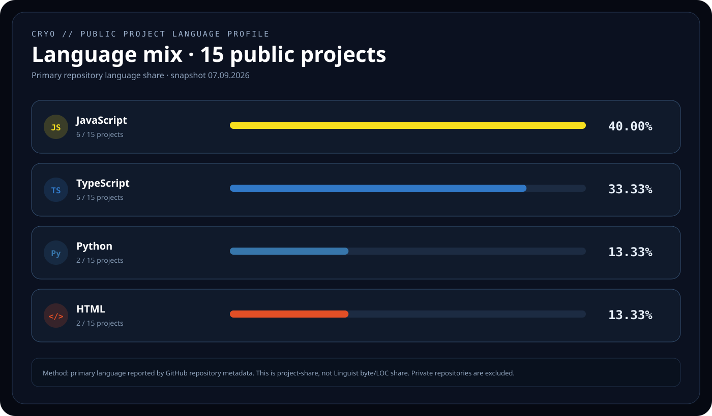
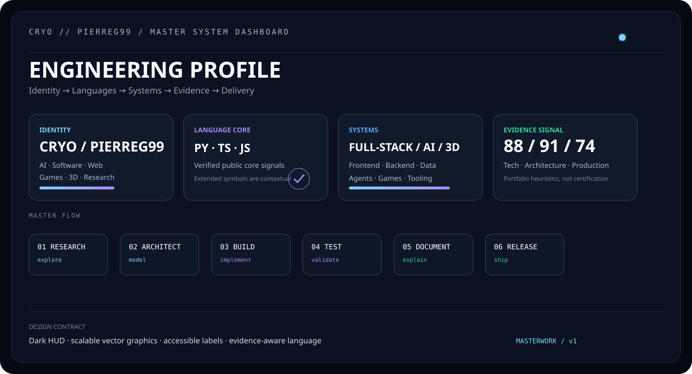
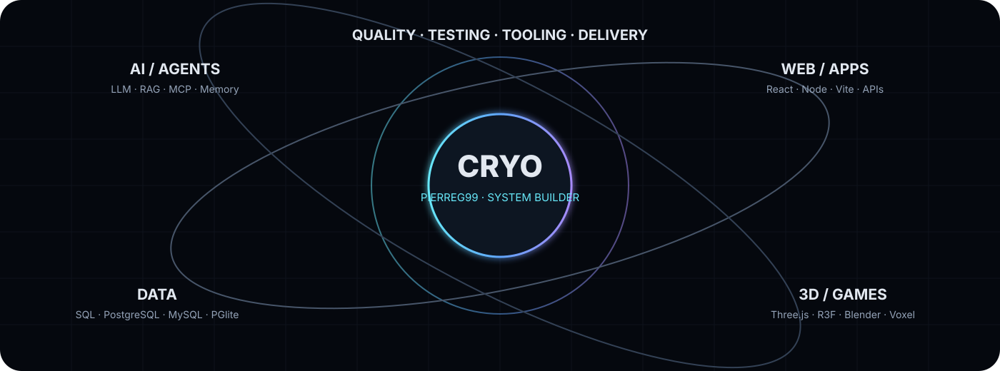
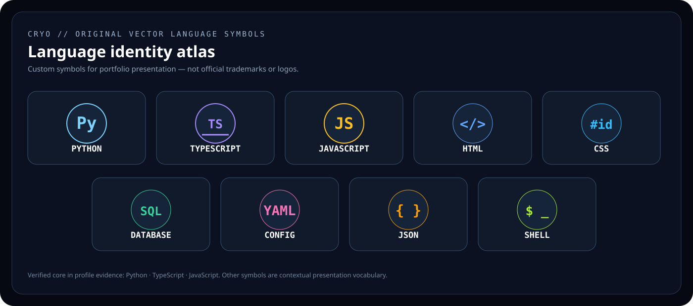
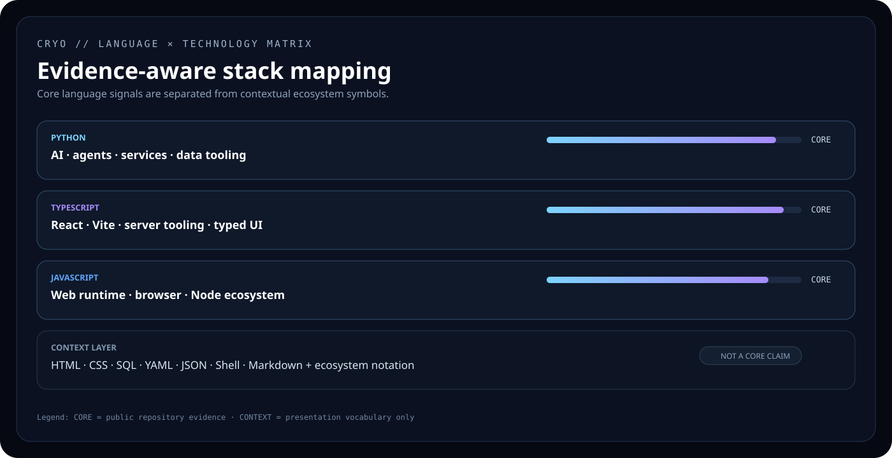

# CRYO / Pierreg99 — Profile

[GitHub](https://github.com/Pierreg99) · [Technical Stack](./TECH-STACK-EN.md) · [Quality Audit](./TECHNICAL-QUALITY-AUDIT-EN.md) · [Academic Evaluation](./ACADEMIC-EVALUATION-EN.md) · [Public Language Report](./PUBLIC-LANGUAGE-PROFILE-EN.md)

## Profile

**Cryopg.it / Pierreg99** builds experimental and product-oriented systems across **Artificial Intelligence, software engineering, web applications, games, 3D and knowledge systems**.

The focus is modular architecture, automation, creative interfaces, AI agents, persistence, testability and documented iteration.

## Profile Architecture

The profile adopts proven portfolio building blocks—intro, connections, activity, languages, frameworks, data, 3D/creative and project highlights—but adapts them to the documented CRYO evidence base and its visual system.

**Flow:** `Identity → Connect → Activity → Languages → Frameworks → Data → 3D/Games → Projects → Evidence`

## Connect & Explore

  

## Activity

The profile favors repository-native evidence, direct project links and renderer-safe badges over fragile third-party statistics. The interactive dashboard adds a reproducible public-project language view.

[Open the interactive language dashboard →](../public-language-dashboard.html)

## Programming Languages

The public snapshot contains 15 repositories and uses each repository's **GitHub-reported primary language**.

| Language | Public projects | Project share |
|---|---:|---:|
| **JavaScript** | 6 | **40.00%** |
| **TypeScript** | 5 | **33.33%** |
| **Python** | 2 | **13.33%** |
| **HTML** | 2 | **13.33%** |

   

> The percentage is **project share**, not lines-of-code or byte share. Snapshot: **7 September 2026**.

## Frameworks & Runtime

  

## Data & Quality

     

## 3D / Games / Creative

The immersive domain covers **Three.js, React Three Fiber, Blender, browser games, voxel systems and visual interfaces** where repository evidence supports the technology.

  

## Technical Domains

| Domain | Focus |
|---|---|
| AI & Agents | LLMs · Agent Memory · RAG · MCP · Context Engineering |
| Programming | Python · TypeScript · JavaScript |
| Frontend | React · Vite · Tailwind CSS · Radix UI · Framer Motion |
| Backend | Node.js · Express · tRPC · REST APIs · Zod · JOSE |
| Data | PostgreSQL · MySQL · SQLite · PGlite · Drizzle ORM · Kysely |
| 3D / Creative | Three.js · React Three Fiber · Blender · Voxel Systems |
| Quality | Vitest · Playwright · Typecheck · Linting · Build Validation |
| Delivery | Git · GitHub · GitHub Actions · GitHub Pages |

## Featured Public Projects

- [agent-memory](https://github.com/Pierreg99/agent-memory) — AI / Agent Memory
- [Nexo-Jarvis-AI-Futuristic-Assistant-Alpha](https://github.com/Pierreg99/Nexo-Jarvis-AI-Futuristic-Assistant-Alpha) — AI Assistant / HUD
- [KiBlox-VoxelGame](https://github.com/Pierreg99/KiBlox-VoxelGame) — Voxel / Game / 3D
- [Chronicles-of-Lumina-GameRPGwork](https://github.com/Pierreg99/Chronicles-of-Lumina-GameRPGwork) — RPG / World
- [Cryoplane-Polygonal-Flight](https://github.com/Pierreg99/Cryoplane-Polygonal-Flight) — 3D / Flight
- [Cyberdash-Rhythm-Platformer](https://github.com/Pierreg99/Cyberdash-Rhythm-Platformer) — Game / Rhythm
- [call-of-groky](https://github.com/Pierreg99/call-of-groky) — Browser FPS / Three.js
- [call-of-boty](https://github.com/Pierreg99/call-of-boty) — Browser FPS / Three.js

## Visual System

## Evidence Boundary

The page separates repository evidence, GitHub primary-language metadata, technical documentation and custom visual symbolism. Custom language symbols are presentation artwork and do not claim to be official brand logos.

Portfolio scores are evidence signals, not certification or personnel assessment.

[Technical Stack](./TECH-STACK-EN.md) · [Quality Audit](./TECHNICAL-QUALITY-AUDIT-EN.md) · [Programming Languages](./PROGRAMMING-LANGUAGES-EN.md) · [Public Language Report](./PUBLIC-LANGUAGE-PROFILE-EN.md) · [Tasks, Time & Progress](../../academic-evaluation/task-time-progress/TASK_TIME_PROGRESS_EN.md)
